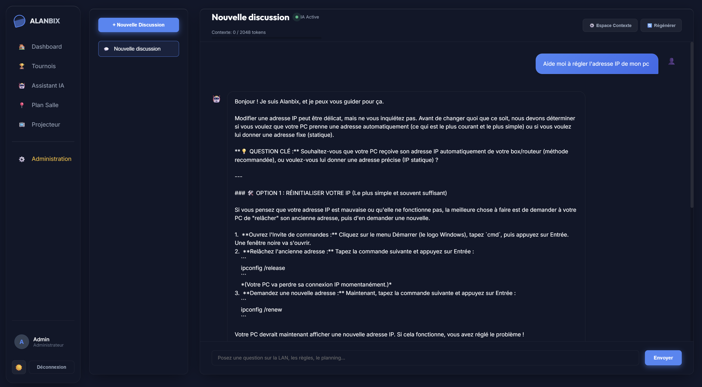

# 🎮 Alanbix — LAN Party Management System

<p align="center">
  
</p>

**Alanbix** (A-LAN-bix) is a next-generation, self-hosted LAN party management system with AI-powered assistance.  
Named as a nod to *Alambix* from the Asterix universe — a complex apparatus that distills knowledge to players through a lightweight, optimized pipeline.

> 🏆 Full tournament engine • 🗺️ Interactive room planner • 🤖 Local AI chat (Ollama) • 📊 Spectator projector mode

---

## ✨ Features

### 🏆 Tournament Engine
- **Multi-format brackets**: Single Elimination, Double Elimination, Round Robin, FFA (Free For All)
- **Team support**: Self-service team creation, ownership, random assignment
- **Live scoring**: Real-time bracket updates via WebSocket
- **Point distribution**: Configurable per-tournament (winner/placement/participation/per-goal)
- **Auto-advancement**: Automatic bracket progression, BYE handling, Grand Final detection

### 📊 Dashboard & Leaderboards
- **Global leaderboard** with movement indicators (↑↓ NEW)
- **Team leaderboard** with weighted/raw scoring modes
- **Live standings** during running tournaments (frontend-only projection)
- **Player profiles** with tournament history and point breakdown

### 📽️ Spectator Mode (Projector)
- **4-slide auto-cycle**: Leaderboard → Teams → Room Map → Bracket
- **Cinematic game images** as fullscreen backdrop with vignette effect
- **Keyboard controls**: ← → (navigate), Space (pause/resume)
- **WebSocket auto-refresh** on score changes
- **Always dark theme** — designed for projector display

### 🗺️ Interactive Room Planner
- **Drag & drop** seat and table placement (admin)
- **Self-service seat picking** by players
- **Auto-fit zoom** across all viewports
- **Cursor-centered zoom** with pan support

### 🤖 AI Chat Assistant (Ollama)
- **Streaming responses** via Server-Sent Events
- **RAG pipeline** with NumPy vector search (no external DB)
- **Multi-instance Ollama** load balancing with priority and failover
- **Context compression** (truncate, compact, AI summary)
- **Message editing & retry** inline
- **Configurable system prompt** via admin panel

### 🛡️ Administration
- **Full player management**: create, edit, reset passwords, promote/demote admins
- **Game library**: with cover image search (SearXNG), upload, and auto-localization
- **Tournament lifecycle**: create → run → score → close → points distributed
- **System settings**: event name, team scoring mode, AI config

---

## 📸 Screenshots

### Dashboard


### Tournaments — Double Elimination


### Tournaments — FFA (Free For All)


### Player Profile


### Spectator — Leaderboard


### Spectator — Tournament Bracket


### Room Plan — Editor


### Room Plan — Zoom View


### Administration — Tournaments


### Administration — Game Library


### Administration — Player Management


### Administration — Settings


### AI Chat Assistant


### Administration — AI Settings


---

## 🚀 Quick Start

### Prerequisites
- [Docker](https://docs.docker.com/get-docker/) & [Docker Compose](https://docs.docker.com/compose/install/)
- *(Optional)* [Ollama](https://ollama.ai/) for AI chat features

### Installation

```bash
git clone https://github.com/Aschefr/Alanbix.git
cd Alanbix
docker compose up -d --build
```

The application will be available at:
- **Frontend**: http://localhost:8080
- **Backend API**: http://localhost:8000
- **API Docs**: http://localhost:8000/docs

### First Steps

1. **Register** the first account — it automatically becomes **admin** 👑
2. Go to **Administration** to configure your LAN name, create games, and set up tournaments
3. Share the URL with players so they can register and join
4. Open **/spectator** on a projector for live display

### Ollama (AI Chat)

If you have Ollama running locally:

```bash
# Default config expects Ollama on http://localhost:11434
ollama serve
```

Configure AI instances in **Administration > IA & Paramètres**.

---

## 🏗️ Architecture

```
Alanbix/
├── backend/              # FastAPI (Python 3.11)
│   ├── app/
│   │   ├── main.py       # App entry, CORS, static files
│   │   ├── models.py     # SQLAlchemy models (SQLite + WAL)
│   │   ├── schemas.py    # Pydantic schemas
│   │   ├── auth.py       # JWT authentication
│   │   ├── database.py   # DB session management
│   │   ├── tournament_engine.py  # Bracket logic (Duel, RR, FFA)
│   │   ├── websockets.py # WebSocket event manager
│   │   └── routers/      # API endpoints
│   ├── static/i18n/      # Translations (fr.json, en.json)
│   └── Dockerfile
├── frontend/             # SvelteKit + Vite
│   ├── src/
│   │   ├── lib/          # API client, auth, WebSocket
│   │   └── routes/       # Pages (dashboard, spectator, etc.)
│   ├── static/           # Fonts, game assets
│   └── Dockerfile
├── docker-compose.yml    # Orchestration
├── VERSION               # SemVer version
└── cahier_des_charges.yaml  # Full specification
```

### Tech Stack

| Layer | Technology |
|-------|-----------|
| **Frontend** | SvelteKit, Vite, Vanilla CSS |
| **Backend** | FastAPI, SQLAlchemy, Pydantic |
| **Database** | SQLite (WAL mode) |
| **AI** | Ollama (local LLM), NumPy (vector search) |
| **Infra** | Docker, Docker Compose |
| **Real-time** | WebSocket, Server-Sent Events |

### Design Principles

- **Zero external dependencies**: Fonts, icons, scripts — everything served locally
- **Offline-first**: Works without internet (game images auto-downloaded locally)
- **Single file database**: SQLite — portable, no setup needed
- **Dark cockpit UI**: Glassmorphism, mesh gradients, smooth transitions

---

## 🌐 Internationalization

Alanbix supports **French** and **English** out of the box.  
Translations are stored in `backend/static/i18n/fr.json` and `en.json`.

> ⚠️ **Important**: Always edit i18n JSON files using Python with `encoding='utf-8-sig'` to prevent BOM corruption.

---

## 📄 License

This project is open source. Feel free to use, modify, and distribute.

---

## 🤝 Contributing

1. Fork the repository
2. Create your feature branch (`git checkout -b feature/amazing-feature`)
3. Commit your changes (`git commit -m 'Add amazing feature'`)
4. Push to the branch (`git push origin feature/amazing-feature`)
5. Open a Pull Request

---

<p align="center">
  Made with ❤️ for LAN parties everywhere
</p>
