# 🎮 Alanbix — Système de Gestion de LAN Party

<p align="center">
  
</p>

**Alanbix** (A-LAN-bix) est un système de gestion de LAN party auto-hébergé de nouvelle génération, assisté par l'IA.  
Nommé en clin d'œil à *Alambix* de l'univers d'Astérix — une machinerie complexe qui distille la connaissance aux joueurs à travers un pipeline technique ultra-léger et optimisé.

> 🏆 Moteur de tournoi complet • 🗺️ Plan de salle interactif • 🤖 Chat IA local (Ollama) • 📊 Mode spectateur pour projecteur

---

## ✨ Fonctionnalités

### 🏆 Moteur de Tournois
- **Brackets multi-formats** : Élimination simple, Double élimination, Championnat (Round Robin), FFA (Chacun pour soi).
- **Gestion des équipes** : Création libre, gestion des droits, répartition aléatoire.
- **Scores en direct** : Mise à jour des brackets en temps réel via WebSocket.
- **Distribution des points** : Configurable par tournoi (gagnant, placement, participation, par but).
- **Source de vérité Backend** : Les points sont calculés côté serveur, aucune dérive côté client.
- **Avancement automatique** : Progression automatique dans le bracket, gestion des "BYE", détection de la Grande Finale.
- **Annuler/Rollback** : Réouverture des tournois clôturés avec annulation automatique des points distribués.
- **Drapeau à damier** : Bannière visuelle claire lorsqu'un tournoi est terminé.
- **Vérouillage des scores** : Délai de saisie (5s) pour les joueurs, verrouillage automatique des matchs terminés, indicateur 🔒 visuel. Seuls les admins peuvent corriger un score verrouillé.

### 📊 Dashboard & Classements
- **Classement global** : Leaderboard avec indicateurs de progression (↑↓ NEW).
- **Classement par équipes** : Modes de calcul pondéré ou brut.
- **Classements live** : Projections en direct générées par le backend.
- **Profils joueurs** : Historique complet des tournois et détail des points obtenus.
- **Page d'informations** : Page formatée en Markdown pour les plannings, règles et liens utiles.
- **Gestionnaire de fichiers** : Les admins peuvent uploader des fichiers utiles (torrents, patchs, configs…) téléchargeables par les joueurs directement depuis la page d'informations.

### 👥 Joueurs & Communauté
- **Annuaire organisé** : Visualisation de tous les participants inscrits, regroupés par équipe.
- **Messagerie privée en direct** : Interface de chat P2P rapide intégrée directement à l'annuaire.
- **Badges de notifications intelligents** : Compteurs de messages non-lus globaux et par joueur, mis à jour instantanément via WebSocket.
- **Messagerie de groupe** : Chat d'équipe privé (🛡️) et chat inter-équipes (⚔️) avec badges non-lus distincts, boutons avec pulse violet, et channels déterministes.
- **Actions rapides** : Raccourcis en un clic pour voir l'historique des points d'un joueur ou localiser son siège sur le plan interactif.

### 📽️ Mode Spectateur (Projecteur)
- **Cycle automatique 4 vues** : Leaderboard → Équipes → Plan de salle → Bracket.
- **Fonds d'écran cinématiques** : Images de jeux en plein écran avec effet de vignetage.
- **Contrôles clavier** : ← → (naviguer), Espace (pause/reprendre).
- **Actualisation WebSocket** : Rafraîchissement automatique au moindre changement de score.

### 🗺️ Plan de Salle Interactif
- **Drag & drop** : Placement libre des sièges et des tables (pour les admins).
- **Sélection en libre-service** : Les joueurs peuvent choisir leur propre place.
- **Navigation depuis le bracket** : Cliquez sur un badge de siège directement dans un arbre de tournoi pour le localiser sur la carte.
- **Zoom auto-adaptatif** : Ajustement automatique à la taille de l'écran.
- **Zoom centré sur le curseur** : Avec prise en charge du déplacement (pan).
- **Éléments logistiques** : Placement de mobilier (portes, cuisine, bar, WC, racks techniques, écrans) avec rotation et drag & drop.

### 🤖 Assistant IA (Ollama)
- **Réponses en streaming** : Affichage fluide via Server-Sent Events.
- **Pipeline RAG** : Recherche vectorielle native avec NumPy (aucune base de données externe requise).
- **Ollama Multi-instances** : Équilibrage de charge avec gestion des priorités et basculement automatique (failover).
- **Compression du contexte** : Troncature, compactage et résumé IA pour économiser les tokens.
- **Édition & Retry inline** : Possibilité de modifier ses messages ou de relancer une génération directement dans le chat.
- **Prompt système configurable** : Personnalisable depuis le panneau d'administration.
- **Notifications de tournoi générées par l'IA** : Messages de fin de match personnalisés et humoristiques pour chaque participant.

### 🔔 Notifications
- **Centre de notifications** : Un espace centralisé pour toutes les alertes des joueurs.
- **Messages IA de tournois** : Résumés automatiques à la clôture d'un événement.
- **Messages Admin** : Alertes lorsqu'un administrateur répond dans une conversation IA.
- **Suivi lu/non-lu** : Compteur animé dans le menu latéral.
- **Alertes d'erreur** : Notifications admin avec bouton pour relancer la génération IA en cas d'échec.
- **Distribution en temps réel** : Broadcast immédiat via WebSocket.

### 🛡️ Administration
- **Gestion complète des joueurs** : Créer, modifier, réinitialiser les mots de passe, promouvoir/révoquer les administrateurs.
- **Modération IA** : Restreindre l'accès à l'IA pour certains joueurs ou prendre la main en direct sur une conversation.
- **Bibliothèque de jeux** : Recherche de jaquettes intégrée (SearXNG), upload manuel et téléchargement local automatique.
- **Cycle de vie des tournois** : Création → Lancement → Scores → Clôture → Distribution des points.
- **Paramètres système** : Nom de l'événement, mode de calcul des équipes, configuration IA.
- **Monitoring des instances IA** : Widget d'état en temps réel (en ligne/occupé/hors ligne) dans la barre latérale.
- **Contrôles de purge (Nuke)** : Suppression en masse pour les tournois, joueurs, jeux, images et notifications.

---

## 📸 Interface & Visite Guidée

### 🏠 L'Expérience Joueur

**Dashboard**  
Le hub central pour tous les participants. Les joueurs peuvent y voir rapidement le classement général, la position de leur équipe, les tournois actifs et les annonces récentes. L'interface propose un design épuré inspiré du glassmorphism.


**Page d'Informations**  
Une page gérée en Markdown où les organisateurs peuvent afficher les horaires, les règles, le code WiFi et les liens importants. Elle défile également automatiquement sur le projecteur !


**Arbres de Tournois (Brackets)**  
Qu'il s'agisse d'un duel tendu en Double Élimination ou d'un match chaotique à 16 joueurs en Chacun pour soi (FFA), la vue du bracket se met à jour en temps réel. Les joueurs peuvent facilement suivre qui avance vers la grande finale.


**Annuaire des Joueurs & Messagerie Privée**  
Besoin de trouver quelqu'un ou de vérifier ses scores ? La page des joueurs regroupe tout le monde par équipe. Cliquer sur un joueur ouvre un chat privé en direct, parfait pour organiser vos matchs ou trouver votre prochain adversaire.
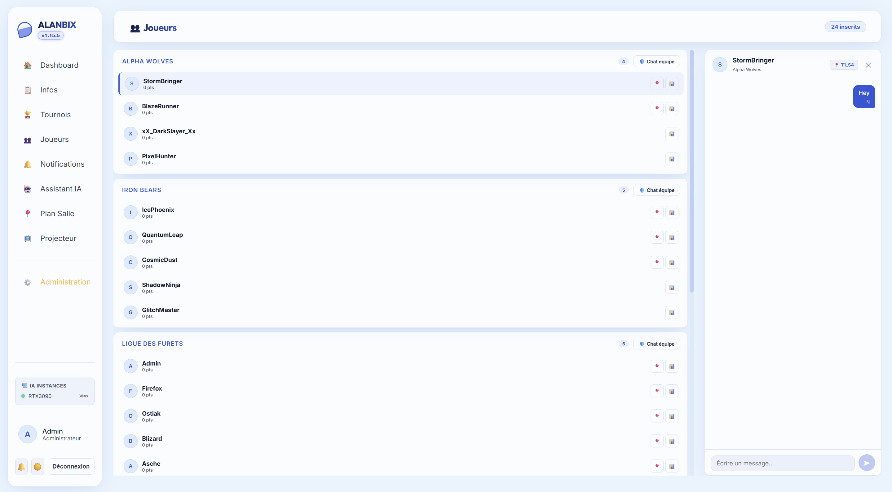

**Centre de Notifications & Profils**  
Ne manquez rien. Lorsqu'un tournoi se termine, l'IA génère un message récapitulatif personnalisé. Les administrateurs peuvent également envoyer des notifications directes, et toutes les alertes non lues sont suivies avec un système de badges unifié. Les joueurs peuvent également consulter le détail complet de leurs points sur leur profil.
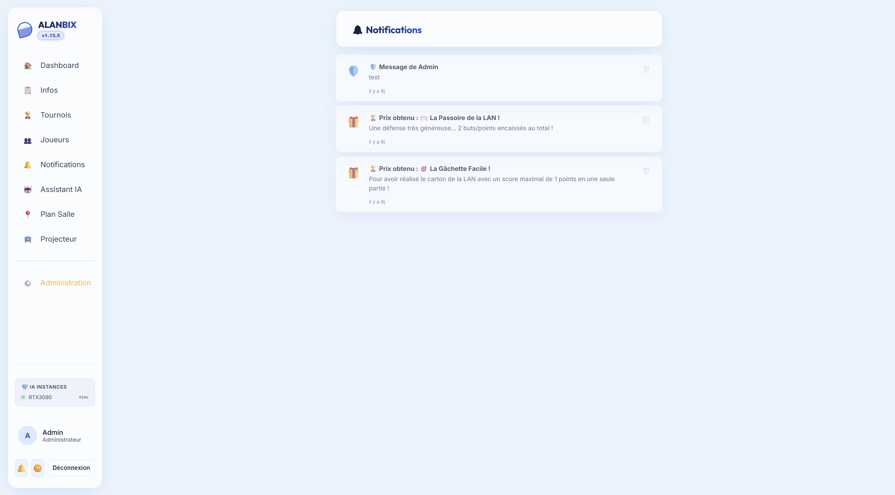
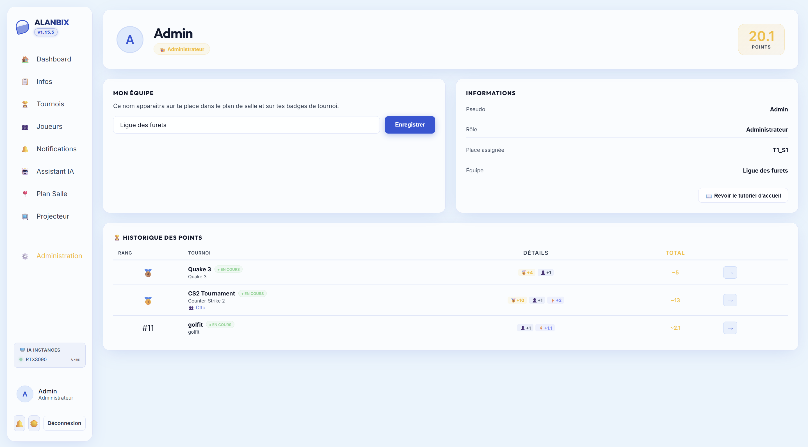

**Plan de Salle Interactif**  
Fini de tourner en rond pour trouver sa place. Les joueurs peuvent zoomer et se déplacer sur la carte interactive pour localiser leur bureau assigné ou voir où sont assis leurs amis.
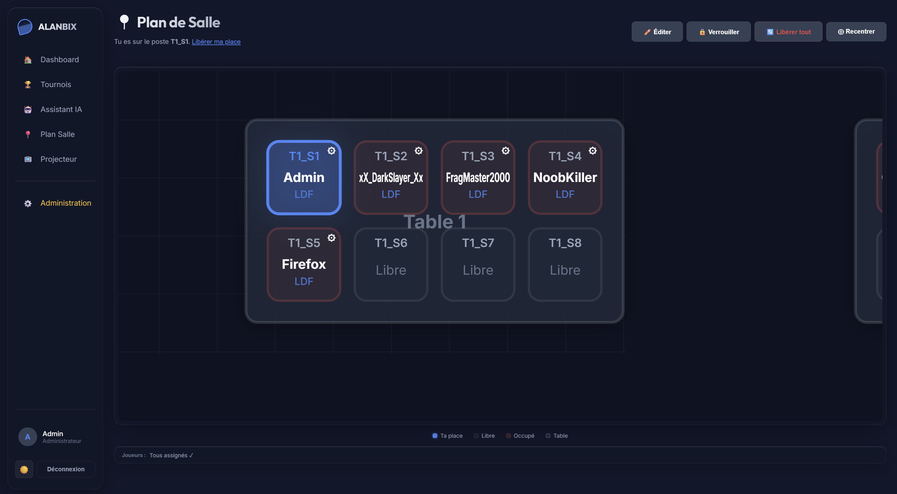

### 🤖 L'Assistant IA

**Le Compagnon Intelligent de la LAN**  
Propulsé par une instance locale d'Ollama, l'assistant IA sait tout sur la LAN. Il peut répondre aux questions sur le planning, le classement actuel ou les règles d'un jeu spécifique, directement depuis l'interface de chat.
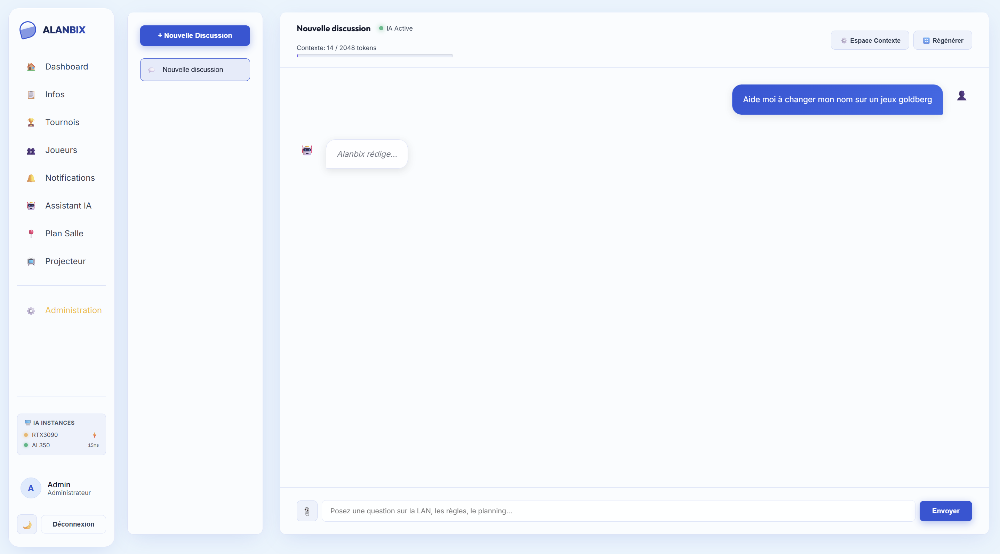
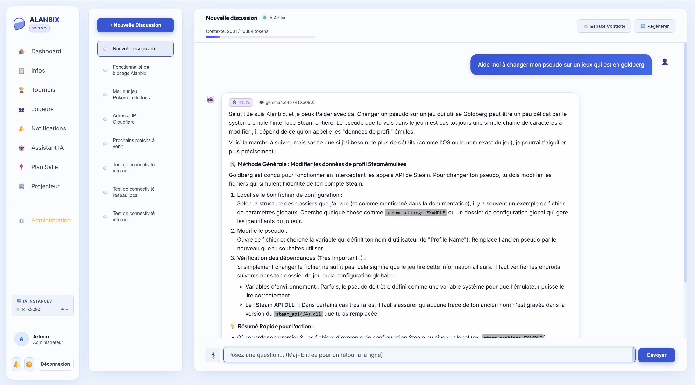

### 📽️ Mode Projecteur (Spectateur)

**Rotation Automatique Mains-libres**  
Conçu pour tourner sur un grand écran ou un vidéoprojecteur, ce mode fait défiler automatiquement le classement, le plan de salle et les arbres de tournois en cours toutes les quelques secondes. Il intègre de superbes fonds d'écran de jeux et force le thème sombre pour une lisibilité optimale dans les pièces sombres.
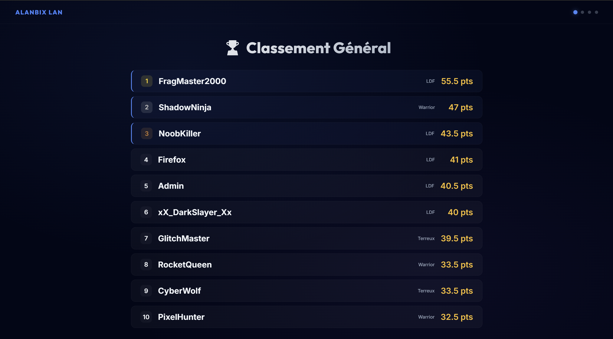
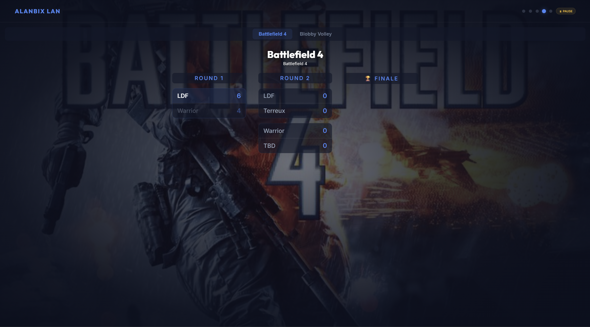

### 🛡️ Administration & Contrôles

**Gestion des Tournois**  
Les administrateurs ont le contrôle total sur le cycle de vie du tournoi : brouillon, lancement, scores et clôture. Ils peuvent également configurer des prompts IA personnalisés pour générer des résumés de fin de match épiques ou hilarants pour les participants.
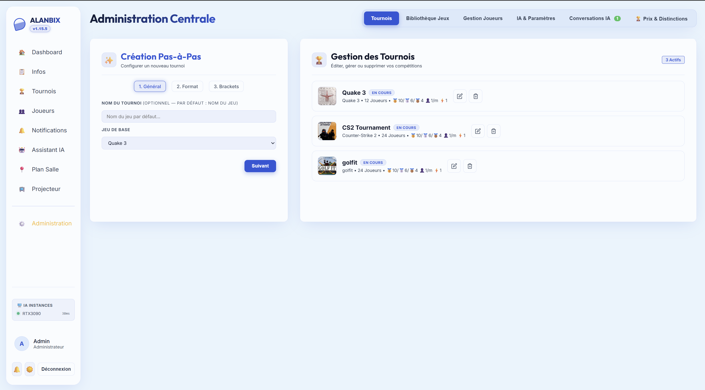
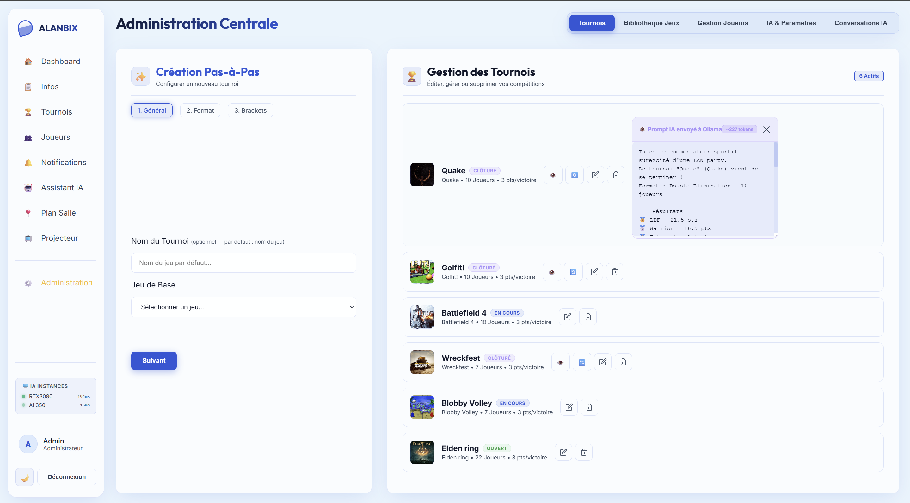

**Éditeur de Plan de Salle**  
Une interface drag-and-drop permettant aux organisateurs de cartographier l'espace physique. Créez des tables, ajoutez des sièges et assignez les joueurs en quelques clics.
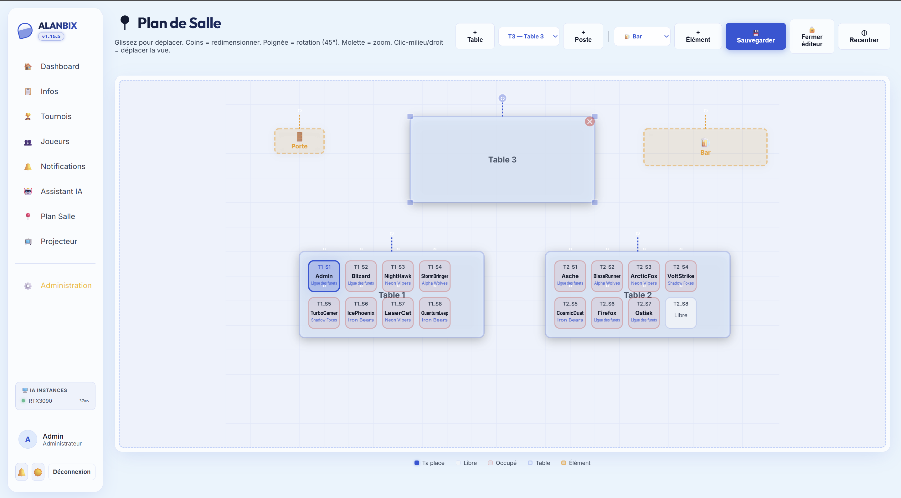

**Bibliothèque de Jeux**  
Gérez les jeux joués pendant la LAN. Le système récupère automatiquement des jaquettes de haute qualité via une intégration SearXNG et les stocke localement pour un fonctionnement garanti hors-ligne.
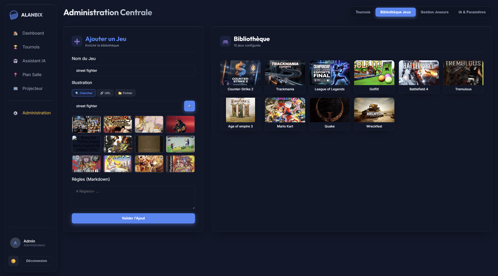

**Modération des Joueurs**  
Les admins peuvent gérer les comptes, réinitialiser les mots de passe et définir les affiliations d'équipes. Besoin d'intervenir ? Les administrateurs peuvent même prendre le contrôle d'une conversation IA pour parler directement à un joueur si le robot s'embrouille !
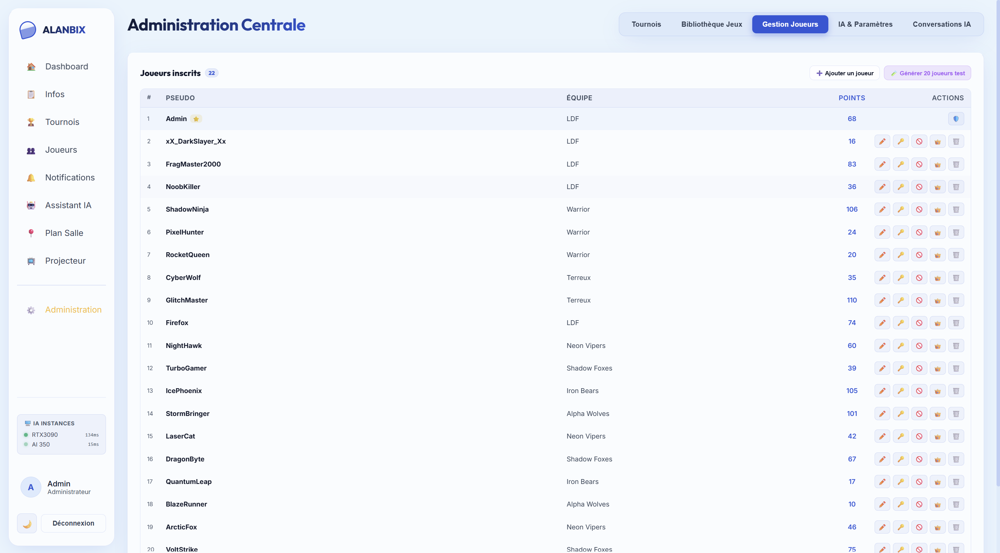
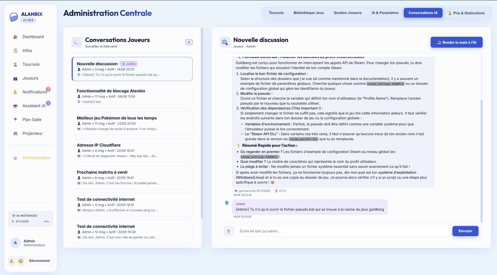

**Paramètres IA & Globaux**  
Configurez les instances Ollama, ajustez les limites de contexte et gérez les paramètres globaux du système. Le tableau de bord inclut un widget d'état en direct pour surveiller la charge et la disponibilité de l'IA.
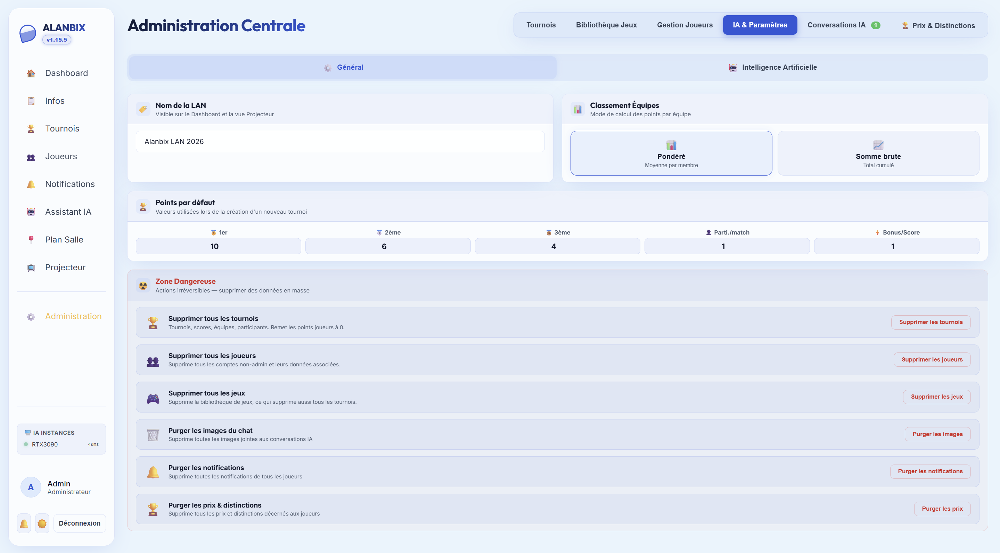
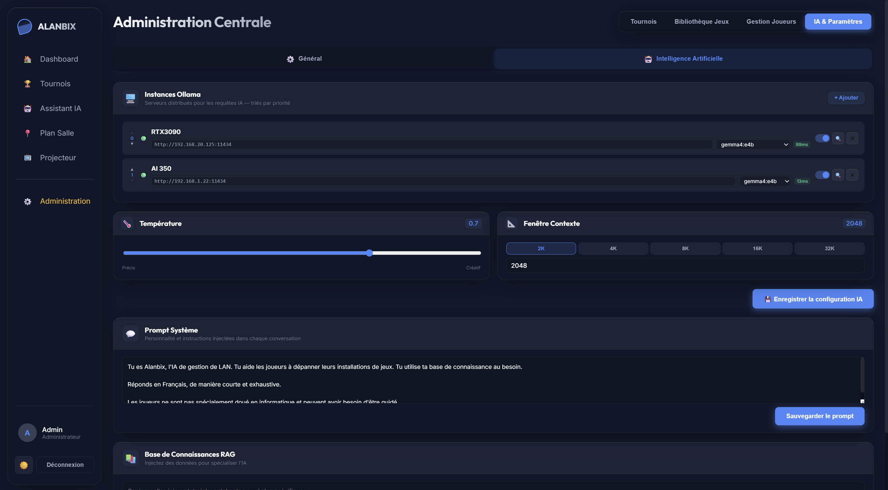

---

## 🚀 Démarrage Rapide

### Prérequis
- [Docker](https://docs.docker.com/get-docker/) & [Docker Compose](https://docs.docker.com/compose/install/)
- *(Optionnel)* [Ollama](https://ollama.ai/) pour les fonctionnalités de chat IA.

### Installation

```bash
git clone https://github.com/Aschefr/Alanbix.git
cd Alanbix
docker compose up -d --build
```

L'application sera disponible sur :
- **Interface Joueurs (Frontend)** : http://localhost:8080
- **API Backend** : http://localhost:8000
- **Documentation API** : http://localhost:8000/docs

### Premiers Pas

1. **Inscrivez-vous** pour créer le premier compte — il devient automatiquement **administrateur** 👑
2. Allez dans l'onglet **Administration** pour configurer le nom de votre LAN, créer des jeux et préparer les premiers tournois.
3. Partagez l'URL aux joueurs pour qu'ils puissent s'inscrire et rejoindre l'événement.
4. Ouvrez **/spectator** sur un projecteur pour l'affichage en direct de la salle.

### Ollama (Chat IA)

Si vous avez Ollama qui tourne localement sur votre machine :

```bash
# La configuration par défaut s'attend à trouver Ollama sur http://localhost:11434
ollama serve
```

Configurez vos instances IA dans **Administration > IA & Paramètres**.

---

## 🏗️ Architecture

```
Alanbix/
├── backend/              # FastAPI (Python 3.11)
│   ├── app/
│   │   ├── main.py       # Point d'entrée, CORS, fichiers statiques
│   │   ├── models.py     # Modèles SQLAlchemy (SQLite + WAL)
│   │   ├── schemas.py    # Schémas Pydantic
│   │   ├── auth.py       # Authentification JWT
│   │   ├── database.py   # Gestion des sessions BDD
│   │   ├── tournament_engine.py  # Logique de brackets (Duel, RR, FFA)
│   │   ├── websockets.py # Gestionnaire d'événements WebSocket
│   │   └── routers/      # Endpoints de l'API
│   ├── static/i18n/      # Traductions (fr.json)
│   └── Dockerfile
├── frontend/             # SvelteKit + Vite
│   ├── src/
│   │   ├── lib/          # Client API, auth, WebSocket
│   │   └── routes/       # Pages (dashboard, spectator, etc.)
│   ├── static/           # Polices, images de jeux
│   └── Dockerfile
├── docker-compose.yml    # Orchestration Docker
├── VERSION               # Version SemVer
└── cahier_des_charges.yaml  # Spécifications complètes du projet
```

### Stack Technique

| Couche | Technologie |
|-------|-----------|
| **Frontend** | SvelteKit, Vite, Vanilla CSS |
| **Backend** | FastAPI, SQLAlchemy, Pydantic |
| **Base de données** | SQLite (mode WAL) |
| **Intelligence Artificielle** | Ollama (LLM Local), NumPy (recherche vectorielle) |
| **Infrastructure** | Docker, Docker Compose |
| **Temps Réel** | WebSocket, Server-Sent Events |

### Principes de Conception

- **Zéro dépendance externe** : Polices, icônes, scripts — absolument tout est hébergé localement.
- **Offline-first** : Fonctionne sans aucune connexion internet (les jaquettes de jeux sont auto-téléchargées localement via SearXNG).
- **Optimisation Matérielle** : Animations et transitions CSS "GPU-friendly", spécifiquement réglées pour réduire les couches de compositing.
- **Base de données monolithique** : SQLite — ultra-portable, aucune configuration requise.
- **Cockpit UI Sombre** : Design moderne avec Glassmorphism, mesh gradients et transitions fluides.

---

## 🌐 Langues & Internationalisation (i18n)

Alanbix a été conçu dès l'origine pour supporter le multi-langue (système i18n prêt à l'emploi côté backend et frontend). Cependant, pour le moment, **l'interface est disponible uniquement en Français**.

Toutes les chaînes de texte se trouvent dans `backend/static/i18n/fr.json`. Si vous souhaitez contribuer à l'ajout de l'anglais, l'architecture est déjà en place !

> ⚠️ **Important (Pour les développeurs)** : Modifiez toujours les fichiers JSON i18n via Python avec `encoding='utf-8-sig'` pour éviter de corrompre le BOM (spécificité sous Windows).

---

## 📄 Licence

Ce projet est open source. N'hésitez pas à l'utiliser, le modifier et le distribuer.

---

## 🤝 Contribution

1. Forkez le dépôt
2. Créez votre branche de fonctionnalité (`git checkout -b feature/ma-super-feature`)
3. Commitez vos changements (`git commit -m 'Ajout d'une super feature'`)
4. Pushez vers la branche (`git push origin feature/ma-super-feature`)
5. Ouvrez une Pull Request

---

<p align="center">
  Fait avec ❤️ pour toutes les LAN parties
</p>
