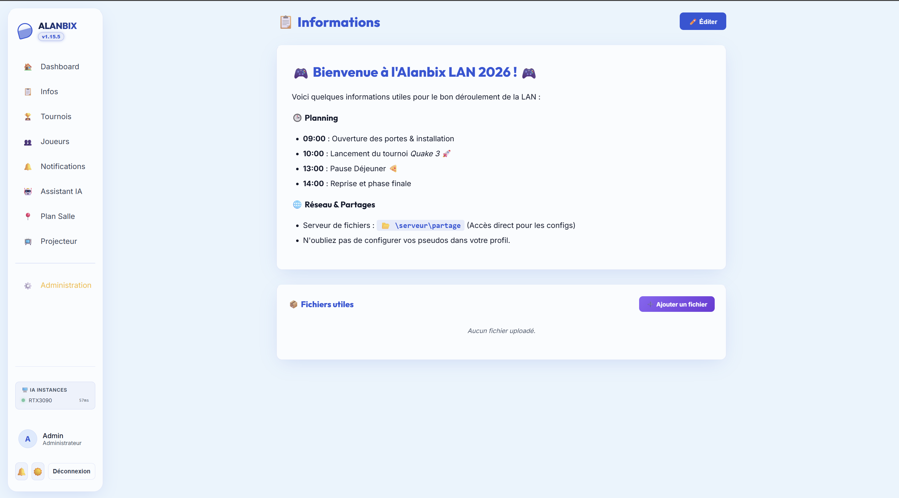

# 📋 General Information Page

Alanbix's information page (route `/dashboard/info`) centralizes announcements, schedules, LAN rules, and useful download links.

---

## ✏️ Page Editing (WYSIWYG Markdown)

System administrators have an integrated text editor based on **EasyMDE**.
* This editor features two separate input tabs:
  1. **Main Content (Players)**: Displays on the dashboard of connected participants (schedule, rules, WiFi codes).
  2. **Projector Content**: Displays only during the automatic scrolling of **Spectator Mode** (e.g., key matches of the evening, meal times).
* Saving is done by writing to the `system_config` table under the respective keys `info_page_content` and `info_spectator_content`.

---

## 📂 Windows Path Detection (G-45)

In a local LAN context, organizers frequently share network folders (e.g., to distribute game installers, patches, or torrents).

* **The Problem**: Web browsers block direct opening of local links (`file://` or UNC network paths `\\share`) by default for security reasons.
* **Alanbix's Solution**:
  1. The Markdown parser of the Info page analyzes the text and automatically detects expressions corresponding to Windows directory paths.
     * Network UNC paths: `\\server\share\folder`
     * Local drive paths: `C:\Games\Alanbix`
  2. These texts are automatically encapsulated in a visual component integrating a folder icon (📂).
  3. **Quick Copy Button**: Left-clicking one of these paths automatically copies the address to the user's clipboard and displays a temporary notification tooltip *"Path copied!"*. The player only needs to paste the path (`Ctrl+V`) into their Windows File Explorer to directly access the LAN's network folder.

---

---

## 📁 Downloadable File Manager

In addition to network links, Alanbix integrates a dedicated physical file manager allowing organizers to host useful files (torrents, game patches, network configuration utilities, `.cfg` files) directly on the server.

### Administration Interface (Upload & Management)
From the **Administration > Files** tab:
* **Select file / Drag & Drop Button**: Allows choosing a file on the computer (limited to 100 MB max per file).
* **"Upload" Button (🚀)**: Sends the file to the server. The backend applies a `_sanitize_filename` function to remove special characters or problematic spaces.
* **Anti-Overwrite Security**: If a file with the same name already exists, the server automatically adds an incremental suffix (e.g., `patch_1.exe`, `patch_2.exe`) rather than overwriting the original file.
* **Delete Button (✕)** (next to each file): Permanently deletes the file from the server's storage.
* **Global Purge Button ("Nuke Files")**: Deletes all uploaded files from the server in bulk (after a security confirmation).

### Player Side (Download)
* Uploaded files automatically appear as **clickable cards** in a dedicated section at the bottom of the information page (`/dashboard/info`).
* Each card shows the **file name**, its **formatted size** (KB, MB), and the **modification date**.
* Left-clicking instantly downloads the file via direct HTTP from the server's static `/data/info_files/` directory, even if the LAN is completely disconnected from the Internet.
