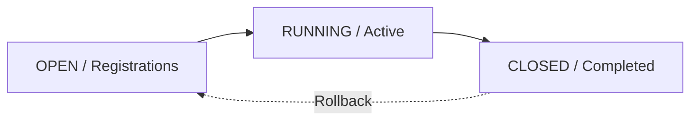
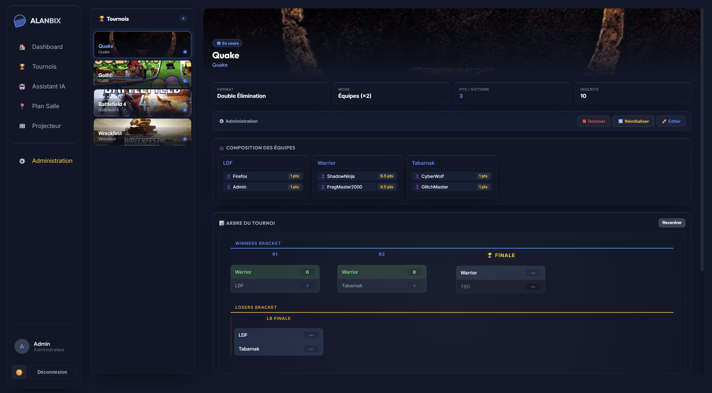
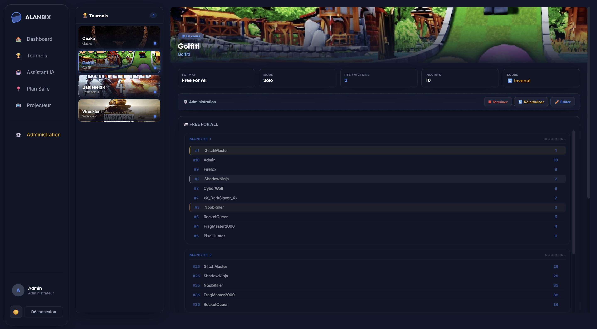

# 🏆 The Tournament Engine

Alanbix's tournament engine (`tournament_engine.py`) is the operational core of the LAN party. It autonomously handles bracket generation, player propagation, score management, and global point distribution.

---

## 🧭 Tournament Lifecycle

A tournament goes through four main statuses in the database:

1. **OPEN**: Registrations are open. Players can register, unregister, or create/join tournament teams.
2. **RUNNING**: The bracket is locked and generated. Matches can be scored. Registrations are closed.
3. **CLOSED**: The final is completed, final standings are frozen, general ranking points are distributed to player profiles, and award notifications are issued.

---

## 🗂️ The 4 Supported Bracket Formats

### 1. Single Elimination (`single_elim`)
* Classic binary tree.
* **Propagation Rule**: The loser is permanently eliminated. The winner advances to the next round (`round + 1`, match = `ceil(m/2)`).
* In case of an odd or non-power-of-2 number of participants, `BYE` slots are generated in Round 1.

### 2. Double Elimination (`double_elim`)
* Same as single elimination but features a **Winners Bracket (WB)** and a **Losers Bracket (LB)**.
* Any player losing in the Winners Bracket is dropped into the Losers Bracket at an equivalent round.
* **Drop Algorithm (Winners -> Losers)**:
  * Losers from `WB Round 1` go to `LB Round 1`.
  * Losers from `WB Round K (K >= 2)` go to Losers round `LB Round 2*(K-1)`.
* The **Grand Final (GF)** pits the undefeated winner of the Winners Bracket against the surviving winner of the Losers Bracket.
* *Display Note*: The Grand Final round is labeled `🏆 FINAL` with a gold style and increased margin to visually distinguish it. Empty Losers rounds are automatically hidden from the DOM.
* **Spectator / Dashboard View**: To prevent horizontal compression on standard resolutions, the Winners Bracket and Losers Bracket are displayed as separate layers, stacked vertically on the Spectator view.

### 3. Championship / Round Robin (`round_robin`)
* No elimination tree. Each participant plays every other participant in turn.
* The system uses the **Circle Method** rotation algorithm to automatically schedule match days (rounds) without scheduling conflicts.
* If the number of participants is odd, a dummy "BYE" participant is inserted in each round.
* **Spectator Readability**: The format features cards with a semi-transparent contrasted background and high-contrast white text for easy reading over cinematic game backgrounds.

### 4. Free For All (`ffa`)
* Suitable for racing games (Trackmania, Mario Kart) or multiplayer fighting games (4-player Smash).
* A round consists of a single series of placements.
* The administrator enters the final ranking of the round in the interface, then configures how many players advance to the next round.
* **Fluid Layout**: The spectator view uses a flexible (`flex-wrap`) and dynamic height (`fit-content`) layout that eliminates any superfluous empty space between rounds.
* **Round Cancellation (Rollback)**: FFA round cancellations are secured by an inline, non-intrusive confirmation modal (avoiding blocking browser `window.confirm` dialogs).

---

## ⚙️ Match & Score Mechanics

### Visual Player Highlight
The connected player's username (or their global/tournament team name) is highlighted in the tournament tree with a blue accent background and a distinctive side border, adapted for both light and dark themes across all bracket formats (Single/Double Elim, Round Robin, FFA).

### Saisie et Verrouillage Automatique (🔒)
* **Who can enter scores?** Any player participating in the match (if the opponent is determined), or an Administrator.
* **TBD Match Scoring**: It is forbidden to enter scores on a match where the opponent is not yet determined (TBD player, ID 0). The corresponding input fields are automatically hidden on the frontend, and the backend rejects any score submission containing a TBD player to prevent bracket corruption.
* **Intelligent Score Fusion**: Submitted scores are atomically merged with existing data on the backend to prevent race conditions and accidental overwrites in case of simultaneous submissions.
* **Input Lock (5s Cooldown)**: To prevent vandalism or simultaneous input errors between opponents, score validation applies a 5-second cooldown.
* **Automatic Lock**: Once the score is submitted and validated by the server, the match is marked with a padlock icon (🔒). Players can no longer modify the score.
* **Admin Override**: Only a system Administrator has the right to overwrite a locked score to correct input errors by players.

### Recursive BYE Resolution
* If a player has no opponent in Round 1 (due to an odd number of participants), the tournament engine detects a `[Player, 0]` match.
* Using the `_is_match_dead()` and `_is_genuine_bye()` functions, the server checks if the empty slot is a definitive "real" BYE or if it is waiting for a winner from a previous match.
* If it is a BYE, the player is automatically propagated to the next round without any administrator intervention.

---

## 👥 Tournament Team Management (Self-Service)

When the **Use Teams** (`config.use_teams = true`) option is enabled for a tournament:

1. **Team Creation**: Any player registered for the tournament can create their own game team using the `Create a team` button. The creator becomes the owner (`created_by`).
2. **Joining a Team**: A registered player who does not have a team sees a `⭐ Join` button on teams that are not full.
3. **Size Constraint (`team_size`)**: The backend verifies via the `add_team_member` endpoint that the team size does not exceed the configured limit, returning an HTTP 400 code if it does.
4. **Negative Team IDs**: To distinguish players from teams in the SQLite tables, team IDs in the bracket are negative (`-team_id`). A `config._team_map` dictionary maintains the Name ↔ ID binding for real-time display.

---

## 💰 Closing, Distribution & Points Rollback

### "Close Tournament" Button (Admin)
Clicking this button triggers the server to calculate the scores and apply the configured points grid:
* `pts_winner`: Points awarded to 1st place.
* `pts_second`: Points awarded to 2nd place.
* `pts_third`: Points awarded to 3rd place.
* `pts_participation`: Points awarded to all participants who played at least one match.
* `pts_per_goal`: Points multiplier per score/goal scored during matches (e.g., 0.5 points per goal in Rocket League).

Calculated points are permanently added to the `points` column in the `users` table. In case of team tournaments, all team members are awarded these points individually.

### "Reopen Tournament" Button (Admin Rollback)
If a tournament was closed by mistake:
1. The admin clicks **Reopen** (Réouvrir).
2. The backend retrieves the points distribution history stored in the tournament's `results` (JSON) field.
3. The server subtracts exactly those point deltas from the concerned players' profiles, reverting the tournament to the **RUNNING** state without corrupting the global leaderboard.

---

## 🎛️ Buttons & Key Actions Glossary

### Administrator Side (🛡️)
* **`Start Tournament` Button**: Generates the initial bracket from registered participants. Switches status from `OPEN` to `RUNNING`.
* **`🎲 Distribute` Button (🎲 Répartir)**: (Only in Team mode, `OPEN` status) Randomly distributes all registered players into created teams to reach the configured size.
* **`Register All Players` Button** (Bulk Join): Registers all accounts in the SQLite database to the tournament in one go.
* **`Unregister Everyone` Button** (Bulk Leave): Empties the participant list and deletes all created teams for this tournament.
* **`Close Tournament` Button**: Calculates podiums, awards global points, and updates the status to `CLOSED`.
* **`Reopen Tournament` Button**: Cancels the closing and starts the automatic subtraction of distributed points.
* **Score Override (Admin Input)**: By clicking a match in the bracket (even if locked 🔒), the admin accesses a priority editing panel to correct any score.
* **`Delete` Button (Trash Icon)**: After security confirmation, permanently deletes the tournament and all its associated data (participants, teams).

### Player Side (👥)
* **`Register` / `Unregister` Buttons**: Allows joining or leaving the tournament participant list (only when status is `OPEN`).
* **`Create a Team` Button**: (Only if team mode is enabled, `OPEN` status) Creates an empty team structure. The player becomes the owner (`created_by`).
* **`⭐ Join` Button**: Allows a registered player to join an incomplete team of another player.
* **`Leave Team` Button**: Removes the player from their current team.
* **`Dissolve Team` Button**: (Owner only) Deletes the team and frees all its members.
* **`Enter Score` Button** (on an active match): Opens the score entry panel (subject to the 5s validation cooldown).
