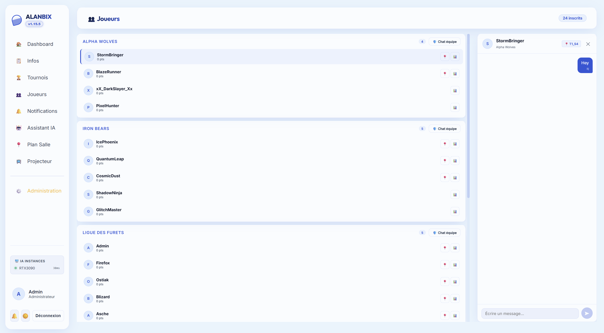
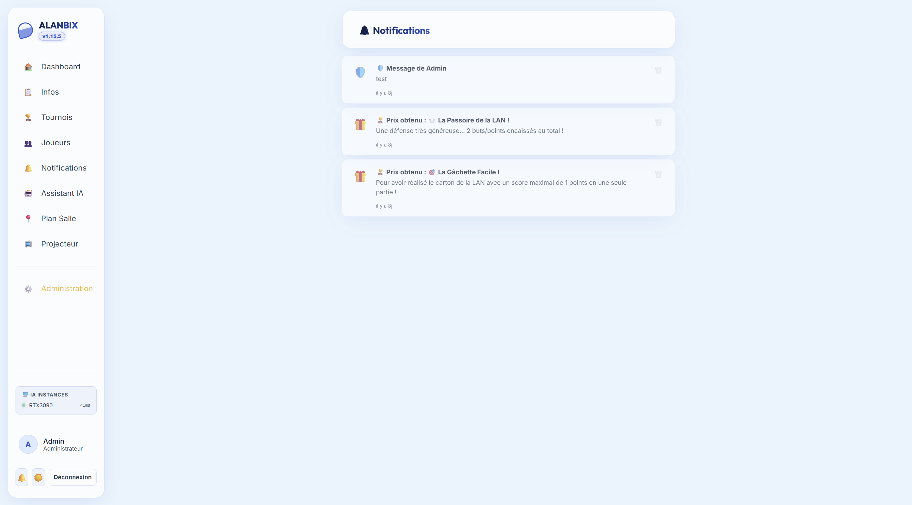

# 💬 Messagerie Directe & Notifications

Alanbix intègre des canaux de communication en temps réel et un centre de notifications unifié permettant de fluidifier l'échange d'informations et d'animer l'événement.

---

## ✉️ Les Systèmes de Chat (Temps Réel)

Alanbix gère les flux de discussion via des connexions WebSocket persistantes (`/ws` géré dans `websockets.py`). Les messages sont instantanément transmis aux destinataires sans que ces derniers n'aient besoin de rafraîchir leur page.

### 1. Chat Privé de Joueur à Joueur (P2P)
* En cliquant sur un profil de joueur depuis l'annuaire, un espace de messagerie directe s'ouvre.
* Les messages sont stockés dans la table SQLite `messages`.
* Le système génère automatiquement des badges de notification rouges avec un compteur de messages non-lus sur le nom de l'expéditeur dans l'annuaire et sur l'onglet messagerie global de la barre latérale.

### 2. Canaux de Groupe d'Équipe Déterministes (G-53)
Pour les besoins tactiques et communautaires de la LAN, Alanbix intègre un système de salons de groupe dont les clés d'identification sont calculées de manière déterministe côté serveur :
* **Chat d'équipe privé (🛡️)** : Réservé uniquement aux joueurs partageant le même `User.team_name`.
  * *Clé de canal* : `team:[NomDeLEquipe]` (ex: `team:Alpha Wolves`).
  * Les boutons d'accès de l'interface possèdent une animation de pulsation violette distinctive.
* **Chat inter-équipes (⚔️)** : Permet à deux équipes distinctes de s'envoyer des défis ou de discuter.
  * *Clé de canal* : `inter:[NomEquipeA]|[NomEquipeB]`. Les noms sont systématiquement triés par ordre alphabétique pour garantir que le canal soit identique quel que soit l'initiateur du chat.
  * *Contrôle de Sécurité* : Seuls les membres des deux équipes concernées (ou un administrateur) peuvent lire ou poster dans ce canal. Le backend réjete toute autre tentative.

### 3. Chat Public de la Salle & Mascotte IA (Dashboard)
Le Dashboard principal intègre un espace de discussion public accessible à l'ensemble des joueurs et organisateurs de la LAN :
* **Interactions avec la Salle & la Carte** : Lorsqu'un joueur assis dans la salle envoie un message, son siège sur le plan interactif s'illumine et une bulle de chat s'élève vers le panneau de discussion.
* **Mascotte IA `@Alanbix`** : En mentionnant `@Alanbix`, l'assistant IA local prend part à la conversation avec son ton gamer et bienveillant (pipeline asynchrone protégé par la file d'attente IA).
* **Indicateur de Saisie Temps Réel (Typing Indicator)** :
  * Détecte instantanément quand un ou plusieurs joueurs tapent au clavier, ainsi que lorsque la mascotte `@Alanbix` prépare sa réponse.
  * Regroupe les rédacteurs dans une phrase unifiée au format `"Untel, untel, Alanbix …"` accompagnée de punchlines humoristiques tournantes adaptées en singulier et pluriel (ex. *"distille un chef-d'œuvre"*, *"font chauffer leurs claviers mécaniques"*).
  * Système résilient avec expiration automatique après 5-6 secondes d'inactivité et arrêt immédiat à l'envoi du message.
* **Fonctionnalités avancées** :
  * **Réactions Émojis & Sélecteur Complet** :
    * Barre de survol compacte avec déclencheur `🙂+`.
    * Menu rapide affichant les **4 émojis récents** de l'utilisateur (mémorisés dans le `localStorage`) et un bouton `➕ Plus d'émojis`.
    * Sélecteur d'émojis standard exhaustif : recherche en direct, 7 onglets thématiques (Récents, Tous, Gaming & LAN, Tags Gamer comme `GG`, `EZ`, `WP`, `GLHF`, `RIP`, `MVP`, `CLUTCH`, Smileys, Gestes, Symboles), navigation au clavier et fermeture au clic extérieur.
    * Pilules de compteurs interactives sous les messages avec toggle instantané, infobulle listant les votants, et synchronisation WebSocket en temps réel.
  * **Réponses & Citations contextuelles** : Bouton `↩️ Répondre` ouvrant une barre de prévisualisation au-dessus du champ de texte (annulable via `✕` ou la touche `Échap`). Le message envoyé intègre un encart de citation cliquable permettant de faire défiler la vue vers le message d'origine avec une brève animation de surbrillance.
  * **Message Épinglé & Annonces Admin** : Bannière discrète et élégante épinglée sous l'en-tête du chat pour diffuser les annonces cruciales de l'organisation. Un clic sur la bannière fait défiler directement la discussion jusqu'au message d'origine. Contrôle d'épinglage et de désépinglage immédiat réservé aux organisateurs.
  * **Notifications sonores synthétiques des mentions (G-17)** : Carillon bicolore doux généré nativement via l'API Web Audio (100% offline, aucun fichier externe), retentissant uniquement lorsqu'un joueur est directement mentionné (`@MonPseudo`). Bouton de bascule persistant (`🔔`/`🔕`) intégré dans l'en-tête du chat.
  * **Médias & Modération** : Partage d'images et de GIFs (jusqu'à 8 Mo), aperçus de liens OpenGraph, ligne de démarcation des messages non-lus avec bouton de retour rapide, et réglages de modération (slowmode, mots interdits, anti-flood).

---

## 🔔 Le Centre de Notifications (Temps Réel)

L'icône en forme de Cloche dans la barre latérale permet d'ouvrir le centre de notifications (table SQL `notifications`).

### Les Différents Types de Notifications
1. **Notifications Admin (`admin`)** : Envoyées lorsqu'un organisateur publie une annonce générale ou répond manuellement à une conversation technique.
2. **Notifications de Tournoi IA (`tournament_ia`)** : Messages d'animation rédigés par l'assistant LLM local à la clôture d'un tournoi (voir ci-dessous).
3. **Notifications de Trophée (`award`)** : Alertes poussées en temps réel lorsqu'un joueur hérite ou se fait détrôner d'une distinction automatique (icône 🎁).

### Résumés de Matchs par l'IA
À la fermeture d'un tournoi, pour chaque participant, le serveur place une tâche de génération IA en file d'attente.
* **Le concept** : L'IA rédige une synthèse personnalisée, taquine ou encourageante de la performance du joueur durant le tournoi (ex: *"Tu as gagné tes 3 premiers matchs haut la main avant de trébucher en demi-finale face à PixelHunter... Ne lâche rien !"*).
* **Le Prompt Système de Notification** : Il est configurable par l'admin.
* **Résilience** : Si l'instance Ollama plante ou renvoie un timeout lors de la génération d'un message, le système de notification affiche une alerte d'erreur sur le tableau de bord de l'administrateur avec un bouton **"Relancer la génération"** pour re-soumettre la tâche dans la file d'attente IA sans bloquer le reste de l'application.
