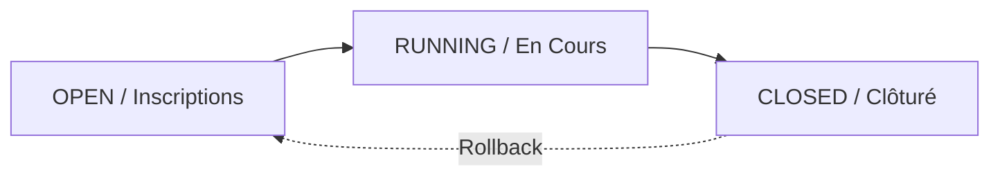

# 🏆 Le Moteur de Tournois

Le moteur de tournoi d'Alanbix (`tournament_engine.py`) est le cœur opérationnel de la LAN party. Il gère de manière autonome la génération de brackets, la propagation des joueurs, la gestion des scores et la distribution des points globaux.

---

## 🧭 Cycle de Vie d'un Tournoi

Un tournoi traverse quatre statuts principaux dans la base de données :

1. **OPEN (Ouvert)** : Les inscriptions sont ouvertes. Les joueurs peuvent s'inscrire, se désinscrire ou créer/rejoindre des équipes.
2. **RUNNING (En Cours)** : Le bracket est verrouillé et généré. Les matchs peuvent être scorés. Les inscriptions sont closes.
3. **CLOSED (Clôturé)** : La finale est terminée, les standings finaux sont figés, les points de classement général sont distribués aux profils des joueurs et les notifications d'awards sont émises.

---

## 🗂️ Les 4 Formats de Bracket Supportés

### 1. Élimination Simple (`single_elim`)
* Arbre binaire classique.
* **Règle de propagation** : Le perdant est éliminé définitivement. Le gagnant avance au round suivant (`round + 1`, match = `ceil(m/2)`).
* En cas d'effectif impair ou non-puissance de 2, des cases `BYE` sont générées au Round 1.

### 2. Double Élimination (`double_elim`)
* Identique à l'élimination simple mais comporte un **Winners Bracket (WB)** et un **Losers Bracket (LB)**.
* Tout joueur perdant dans le Winners Bracket est basculé (droppé) dans le Losers Bracket à un round équivalent.
* **Algorithme de Drop (Winners -> Losers)** :
  * Les perdants de `WB Round 1` vont vers `LB Round 1`.
  * Les perdants de `WB Round K (K >= 2)` vont vers le round de Losers `LB Round 2*(K-1)`.
* La **Grande Finale (GF)** oppose le gagnant invaincu du Winners Bracket au vainqueur rescapé du Losers Bracket.
* *Note d'affichage* : Le round de la Grande Finale est labellisé `🏆 FINALE` avec un style doré et une marge d'espacement accrue pour le distinguer visuellement. Les rounds Losers vides sont automatiquement masqués du DOM.

### 3. Championnat / Tout contre tous (`round_robin`)
* Pas d'arbre d'élimination. Chaque participant affronte tous les autres participants à tour de rôle.
* Le système utilise l'**Algorithme de Rotation (Circle Method)** pour planifier automatiquement les journées (rounds) de match sans conflit de calendrier.
* Si le nombre de participants est impair, un participant fantôme "BYE" est inséré à chaque round.

### 4. Chacun pour Soi (`ffa` / Free For All)
* Adapté aux jeux de course (Trackmania, Mario Kart) ou de combat multijoueur (Smash à 4).
* Une manche se compose d'une seule série de placements.
* L'administrateur saisit le classement final de la manche dans l'interface, puis définit par configuration combien de joueurs avancent à la manche suivante.

---

## ⚙️ Les Mécaniques de Match et de Score

### La Saisie et le Verrouillage Automatique (🔒)
* **Qui peut saisir ?** N'importe quel joueur participant au match concerné, ou un Administrateur.
* **Le Verrou de Saisie (Cooldown de 5s)** : Pour éviter le vandalisme ou les erreurs de saisie simultanée entre adversaires, la validation du score applique un cooldown de 5 secondes.
* **Le Verrou Automatique** : Une fois le score soumis et validé par le serveur, le match est marqué d'une icône Cadenas (🔒). Les joueurs ne peuvent plus modifier le score.
* **Forçage Admin** : Seul un Administrateur système a le droit d'écraser un score verrouillé pour corriger une erreur de saisie des joueurs.

### La Résolution récursive des "BYE"
* Si un joueur n'a pas d'adversaire au Round 1 (suite à un nombre impair de participants), le moteur de tournoi détecte un match `[Joueur, 0]`.
* Grâce à la fonction `_is_match_dead()` et `_is_genuine_bye()`, le serveur vérifie si la place vide est un "vrai" BYE définitif ou si elle attend un vainqueur de match précédent.
* Si c'est un BYE, le joueur est automatiquement propagé au round suivant sans que l'administrateur n'ait à intervenir.

---

## 👥 Gestion des Équipes de Tournoi (Self-Service)

Lorsque l'option **Utiliser des équipes** (`config.use_teams = true`) est activée pour un tournoi :

1. **Création d'Équipe** : Tout joueur inscrit au tournoi peut créer sa propre équipe de jeu via le bouton `Créer une équipe`. Le créateur en devient le "propriétaire" (`created_by`).
2. **Rejoindre une Équipe** : Un joueur inscrit et n'ayant pas d'équipe voit un bouton `⭐ Rejoindre` sur les équipes qui ne sont pas complètes.
3. **Contrainte de taille (`team_size`)** : Le backend vérifie via l'endpoint `add_team_member` que la taille de l'équipe ne dépasse pas la limite définie sous peine de renvoyer un code HTTP 400.
4. **ID Équipes Négatifs** : Pour distinguer les joueurs des équipes dans les tables SQLite, les identifiants d'équipes dans le bracket sont négatifs (`-team_id`). Un dictionnaire `config._team_map` maintient la liaison Nom ↔ ID pour l'affichage en temps réel.

---

## 💰 Clôture, Distribution & Rollback des Points

### Bouton "Clôturer le Tournoi" (Admin)
Au clic sur ce bouton, le serveur calcule les scores et applique la grille de points configurée :
* `pts_winner` : Points attribués au 1er.
* `pts_second` : Points attribués au 2ème.
* `pts_third` : Points attribués au 3ème.
* `pts_participation` : Points attribués à tous les participants ayant joué au moins un match.
* `pts_per_goal` : Multiplicateur de points par point/but marqué durant les matchs (ex: 0.5 points par but à Rocket League).

Les points calculés sont ajoutés définitivement à la colonne `points` de la table `users`. En cas de tournoi en équipe, tous les membres de l'équipe se voient attribuer ces points individuellement.

### Bouton "Réouvrir le Tournoi" (Rollback Admin)
Si un tournoi a été clôturé par erreur :
1. L'admin clique sur **Réouvrir** (Reopen).
2. Le backend récupère l'historique des points distribués stocké dans le champ `results` (JSON) du tournoi.
3. Le serveur soustrait exactement ces deltas de points des profils des joueurs concernés, ramenant le tournoi à l'état **RUNNING** sans corrompre le classement global.

---

## 🎛️ Lexique des Boutons & Actions Clés

### Côté Administrateur (🛡️)
* **Bouton `Démarrer le tournoi`** : Génère le bracket initial à partir des participants inscrits. Passe le statut de `OPEN` à `RUNNING`.
* **Bouton `🎲 Répartir` (🎲 Distribute)** : (Seulement en mode Équipes, statut `OPEN`) Répartit aléatoirement tous les joueurs inscrits dans des équipes créées pour atteindre la taille configurée.
* **Bouton `Inscrire tous les joueurs`** (Bulk Join) : Inscrit en une fois tous les comptes de la base SQLite au tournoi.
* **Bouton `Désinscrire tout le monde`** (Bulk Leave) : Vide la liste des participants et supprime toutes les équipes créées pour ce tournoi.
* **Bouton `Clôturer le Tournoi`** : Calcule les podiums, attribue les points globaux et met à jour le statut en `CLOSED`.
* **Bouton `Réouvrir le Tournoi`** : Annule la clôture et lance la soustraction automatique des points distribués.
* **Forçage de Score (Saisie Admin)** : En cliquant sur un match du bracket (même s'il est verrouillé 🔒), l'admin accède à un panneau d'édition prioritaire pour corriger n'importe quel score.
* **Bouton `Supprimer` (Icône Corbeille)** : Après confirmation de sécurité, supprime définitivement le tournoi et toutes ses données associées (participants, équipes).

### Côté Joueur (👥)
* **Boutons `S'inscrire` / `Se désinscrire`** : Permet de rejoindre ou quitter la liste des participants au tournoi (uniquement lorsque le statut est `OPEN`).
* **Bouton `Créer une équipe`** : (Seulement si le mode équipe est activé, statut `OPEN`) Crée une structure d'équipe vide. Le joueur en devient le propriétaire (`created_by`).
* **Bouton `⭐ Rejoindre`** : Permet à un joueur inscrit de rejoindre une équipe incomplète d'un autre joueur.
* **Bouton `Quitter l'équipe`** : Retire le joueur de son équipe actuelle.
* **Bouton `Dissoudre l'équipe`** : (Propriétaire uniquement) Supprime l'équipe et libère tous ses membres.
* **Bouton `Saisir le score`** (sur un match actif) : Ouvre le panneau de saisie des scores (soumis au cooldown de validation de 5s).
