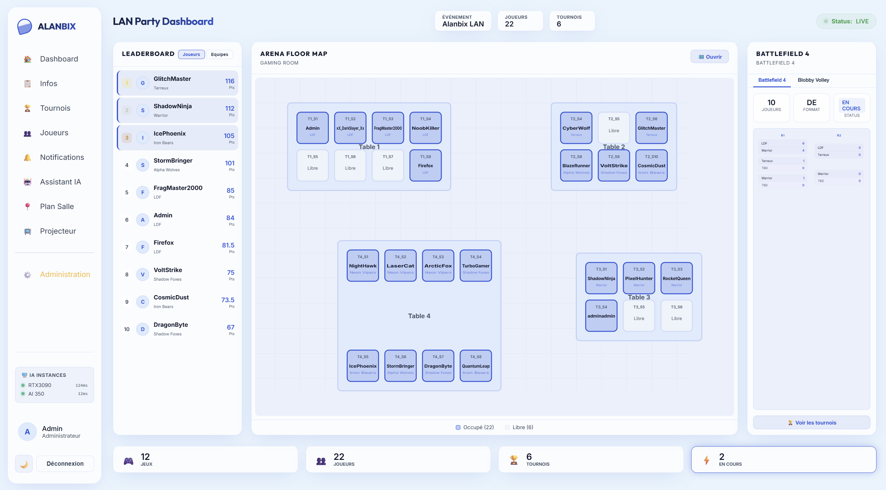

# 🚀 Guide de Démarrage Rapide

Ce guide vous aide à installer et configurer Alanbix pour la première fois pour votre événement.

---

## 💾 Prérequis
* **Docker & Docker Compose** installés sur votre serveur de LAN.
* **Ollama ou endpoint compatible OpenAI (LocalAI, etc.)** (facultatif mais recommandé pour l'IA) en cours d'exécution locale ou sur le réseau.

---

## 🛠️ Étape 1 : Déploiement

Alanbix peut être installé de trois manières différentes selon vos besoins de production et de développement.

### Option A : Depuis Docker Hub (Recommandé pour la Production)
Pour un déploiement rapide sans compiler le code, utilisez l'image unifiée standalone disponible sur Docker Hub (`aschefr/alanbix:latest`) :

```bash
docker run -d \
  -p 41481:41481 \
  -v alanbix_data:/app/data \
  --name alanbix \
  aschefr/alanbix:latest
```

* L'application tourne sur le port unique `41481` (qui sert à la fois le frontend et le backend).
* Les données de la base SQLite et des téléversements de fichiers sont conservées dans le volume `alanbix_data`.

#### 🔍 (Optionnel) Déployer SearXNG pour la recherche de jaquettes
Si vous utilisez le déploiement Docker Hub (Option A) et souhaitez bénéficier de la recherche automatique de jaquettes de jeux, vous devez lancer une instance SearXNG à côté :
1. Créez un fichier `settings.yml` en activant le format de sortie JSON (requis par le backend) :
   ```yaml
   use_default_settings: true
   server:
     secret_key: "remplacez_ceci_par_une_cle_securisee_aleatoire"
   search:
     formats:
       - html
       - json
   ```
2. Lancez le conteneur SearXNG :
   ```bash
   docker run -d \
     -p 8888:8080 \
     -v /chemin/vers/votre/settings.yml:/etc/searxng/settings.yml \
     --name alanbix_searxng \
     searxng/searxng:latest
   ```
3. Dans le panneau d'administration d'Alanbix (**Administration > Paramètres**), renseignez l'URL de votre API SearXNG (ex: `http://<IP_DE_VOTRE_SERVEUR>:8888`).

---

### Option B : Clonage du Dépôt (Pour le Développement et la modification du code)
Si vous souhaitez modifier le code ou exécuter le projet en local avec le rechargement automatique (HMR) :

1. Clonez le dépôt git :
   ```bash
   git clone https://github.com/Aschefr/Alanbix.git
   cd Alanbix
   ```
2. **(Optionnel - Pour l'accès réseau LAN)** : Si vous souhaitez y accéder depuis d'autres appareils de votre réseau local :
   * Copiez le fichier de configuration d'exemple :
     ```bash
     cp .env.example .env
     ```
   * Ouvrez `.env` et définissez `LAN_IP` avec l'adresse IP locale de votre machine hôte (ex: `LAN_IP=192.168.1.50`).
3. Lancez les conteneurs :
   ```bash
   docker compose up -d --build
   ```
4. L'application est alors accessible sur :
   * **Interface Web (Frontend)** : `http://localhost:41481` (ou `http://<IP_DE_VOTRE_PC>:41481` depuis le LAN)
   * **Documentation de l'API (Backend)** : `http://localhost:8000/docs`

---

### Option C : Sur Unraid (Community Applications / Modèle XML)
Alanbix dispose d'un modèle officiel pour Unraid :

1. Ouvrez l'onglet **Docker** de votre interface Unraid.
2. Cliquez sur **Add Container**.
3. Dans le menu déroulant **Template**, sélectionnez **User Templates > Alanbix**.
4. *(Si le modèle n'apparaît pas)* : Copiez le fichier `unraid-template.xml` présent à la racine du dépôt Git dans le répertoire `/boot/config/plugins/dockerMan/templates-user/alanbix.xml` de votre clé USB Unraid.
6. Cliquez sur **Apply** pour démarrer le conteneur !

#### 🔍 (Optionnel) Configurer SearXNG sur Unraid
Si vous hébergez Alanbix sur Unraid et souhaitez activer la recherche automatique de jaquettes :
1. Allez dans l'onglet **Apps** (Community Applications) d'Unraid, recherchez **SearXNG** et installez-le.
2. Éditez le fichier de configuration de SearXNG dans votre dossier appdata d'Unraid :
   Généralement accessible sur le partage à `/mnt/user/appdata/searxng/settings.yml`.
3. Assurez-vous d'activer le format JSON en ajoutant `json` aux formats de recherche :
   ```yaml
   search:
     formats:
       - html
       - json
   ```
4. Redémarrez le conteneur SearXNG depuis l'interface Unraid.
5. Dans le panneau d'administration d'Alanbix, renseignez l'URL de votre API SearXNG (ex : `http://<IP_DE_VOTRE_UNRAID>:<PORT_SEARXNG>`).

---

---

## 👑 Étape 2 : Créer le Compte Administrateur

Alanbix attribue automatiquement les droits d'administration globale au **premier utilisateur créé** sur l'application.

1. Rendez-vous sur `http://localhost:41481`.
2. Cliquez sur **S'inscrire** (Register).
3. Remplissez le formulaire (nom d'utilisateur et mot de passe).
4. Une fois connecté, vous verrez apparaître l'onglet **Administration** (🛡️) dans votre menu latéral gauche.



---

## ⚙️ Étape 3 : Configuration Globale

Allez sur **Administration > Paramètres (Settings)** :

* **Nom de la LAN** : Personnalisez l'en-tête de l'application (ex: *Retro LAN 2026*).
* **Mode de Calcul d'Équipe** :
  * *Raw (Brut)* : Somme totale des points.
  * *Weighted (Pondéré)* : Somme divisée par la taille de l'équipe (évite de pénaliser les petites équipes).
* **Prompt Système** : Personnalisez la personnalité de l'IA (ex: *"Tu es le commentateur officiel d'une LAN party fun"*).

---

## 🎮 Étape 4 : Jeux, Plan de Salle & IA

Pour que les fonctionnalités soient exploitables, l'administrateur doit préparer l'environnement :

1. **Ajout de Jeux** : Dans **Administration > Jeux**, créez les fiches des jeux qui feront l'objet de tournois. Utilisez la recherche SearXNG intégrée pour télécharger automatiquement les jaquettes de jeux directement sur votre serveur pour l'offline-first.
2. **Dessin de la Salle** : Dans **Administration > Plan de salle**, disposez les tables, chaises et autres mobiliers logistiques par Glisser-Déposer (Drag & Drop). Les joueurs pourront ensuite cliquer sur ces sièges pour réserver leur emplacement physique dans la pièce.
3. **Activation de l'IA** : Dans **Administration > IA & Paramètres**, ajoutez l'URL de votre instance Ollama ou compatible OpenAI (ex : `http://192.168.1.100:11434` pour Ollama, ou `http://192.168.1.100:8080/v1` pour OpenAI/LocalAI), assignez-lui un modèle et vérifiez son statut (🟢 Connecté).

---

## 🏆 Étape 5 : Lancement du Premier Tournoi

1. Allez sur **Administration > Tournois > Nouveau Tournoi**.
2. Suivez le wizard en 3 étapes :
   * **Général** : Nommez le tournoi, associez le jeu pré-configuré.
   * **Format** : Choisissez si c'est individuel ou en équipe (et définissez la taille de l'équipe).
   * **Bracket & Points** : Choisissez le format de bracket (ex: *Double Élimination*) et configurez les points par victoire, participation, buts, etc.
3. Le tournoi créé apparaît alors au statut **OPEN** (Ouvert). Vos joueurs peuvent s'y inscrire depuis leur dashboard !

---

Prochaine étape : Consultez le guide sur le **[Moteur de Tournois](features/tournaments.md)** pour apprendre à piloter et clôturer le bracket.
